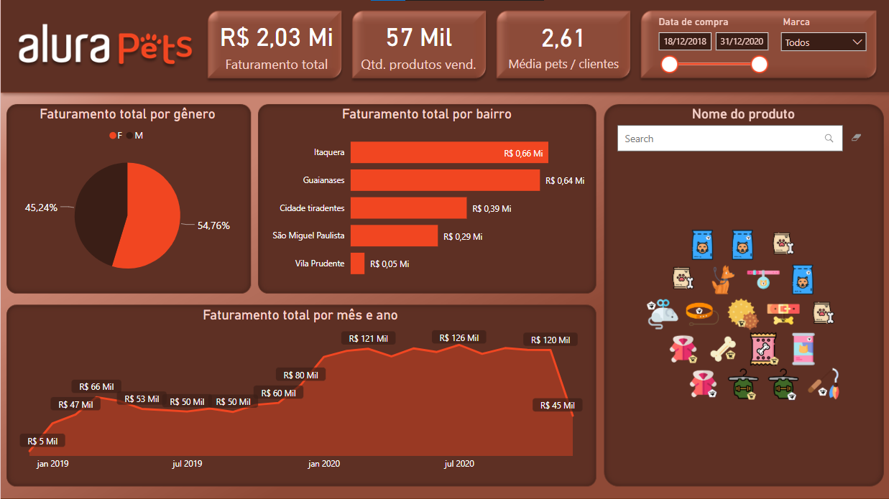
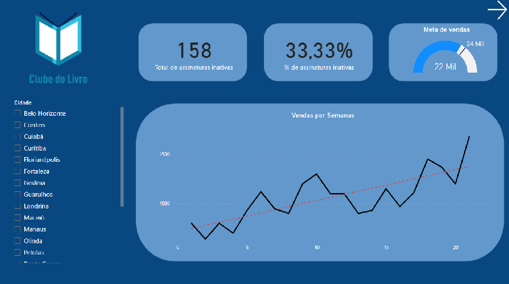
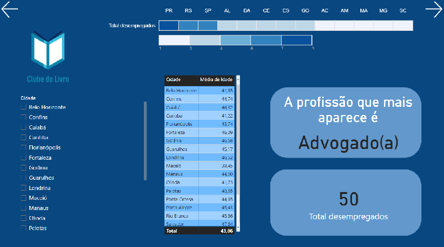
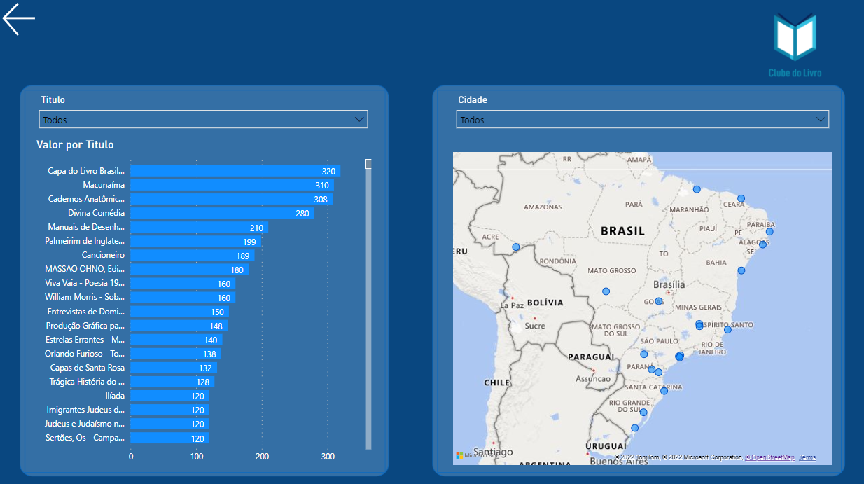
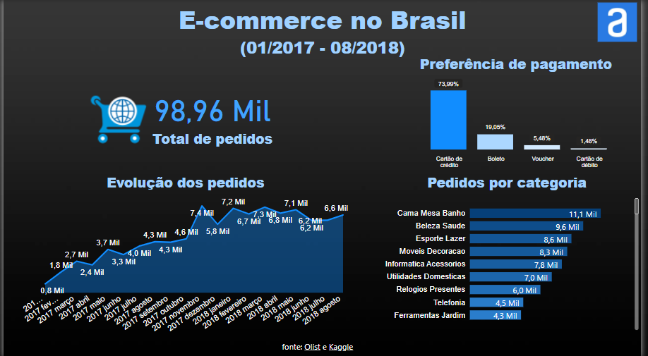

# Power-BI 

Dashboards developed in Microsoft Power BI

Worked concepts:
- Business Intelligence 
- Data processing within Power BI
- Dynamic measurements and calculations
- Data visualization types in Power BI
- DAX and M languages
- Web Scraping

## Alura Pets

Simulation of a request to create a dashboard for a petshop. In this Petshop there are two great brands and it would be necessary to do an analysis considering their differences.

The Dashboard must answer the following questions raised by Petshop: 
- Total billing
- Filter by brand
- View available products
- Show the genre that buys the most in the store
- Average petz per customer.

Dashboard was created in desktop version and also with mobile layout:

<ul>
  <a href="Alura Pets.pbix">Alura Pets</a>
</ul>

Dashboard preview:

## Clube do Livro

Create a dashboard from Clube do Livro metrics

Dashboard was created in desktop version:

<ul>
  <a href="Clube do livro.pbix">Clube do Livro </a>
</ul>

Dashboard preview:

## Olist E-commerce

Create a dashboard from Olist e-commerce metrics and Web Scraping

Dashboard was created in desktop version:

<ul>
  <a href="Dashboard+Olist.pbix">Olist E-commerce </a>
</ul>

Dashboard preview:

